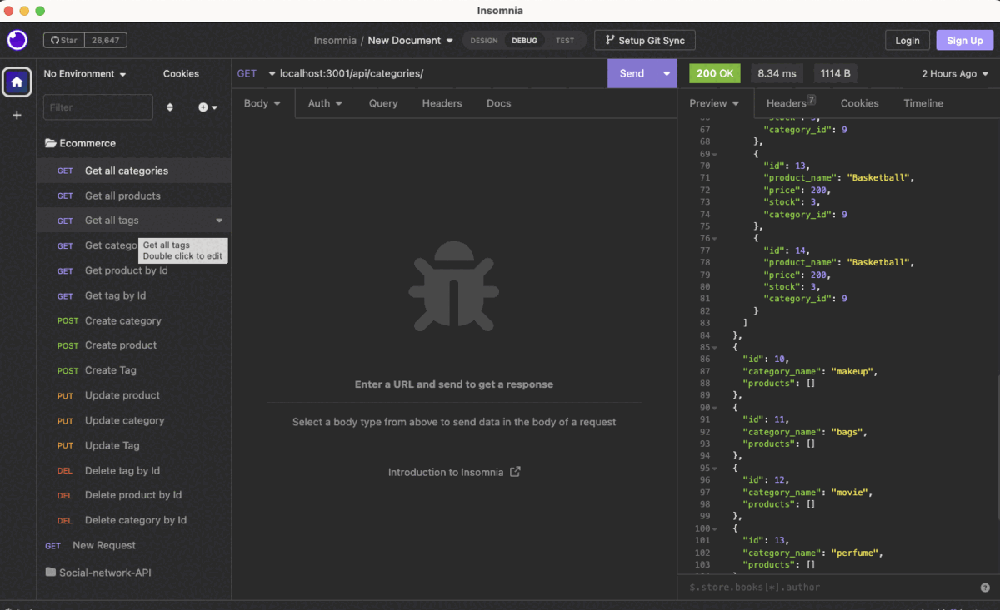
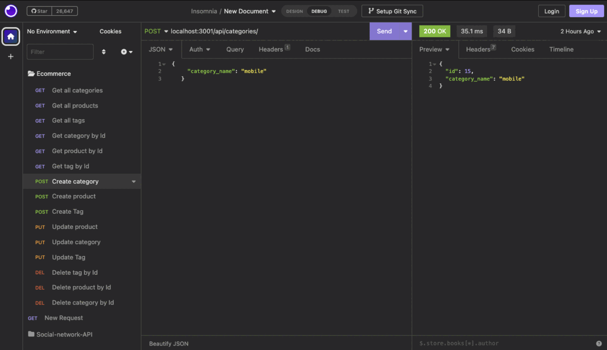
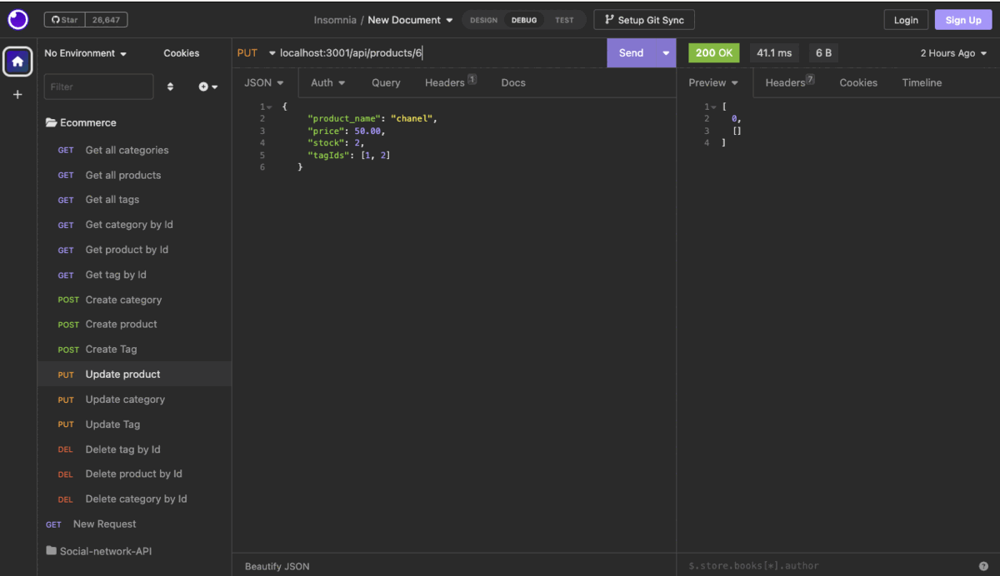
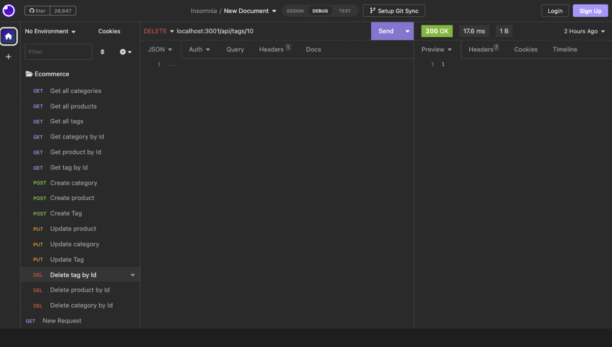

# E-Commerce Back End

## Task

As a full stack web developer you need to modify the starter code to build the back end of an e-commerce site . And for that to interact with a MySQL database, you need to configure a working Express.js API to be able to use Sequelize .

## User Story

```md
AS A manager at an internet retail company
I WANT you to take advantage of the latest technology to build a back end for my e-commerce website
```

## Acceptance Criteria

```md
GIVEN the functional Express.js API
WHEN I enter my database name then I should enter the MySQL username and my password for MySQL to an environment variable file
THEN  with taking advantage of using Sequelize I can connect to a database 
WHEN I enter the  schema and seed commands
THEN I can view that a development database is created and is seeded with example or test data
WHEN I enter the command to invoke the application
THEN my with this command the server is starting and the Sequelize models are synced to  MySQL database
WEHN I begin with API GET routes in Insomnia for the categories, products, or tags
THEN the data for each of these routes will be shown in a formatted JSON
WHEN I test other routes like API POST, PUT, and DELETE routes in Insomnia
THEN I am also able to create, update, and delete the data in my database
```

## Mock-up

There are two walk through videos here one for MySQL workbench and one for insomnia and I have two links for each one.








[Two links for the first video. E-commerce walk through video for MySQl workbench first link to Google drive, better quality](https://drive.google.com/file/d/1M2nJUOoExcWfIWBcCb5QawM8gR1X3jUg/view) [same video in Youtube](https://youtu.be/Pkt5IT6hmwY)the same video in google drive for additional guidance on creating a video.

[Two links for the second video. E-commerce walk through video for Insomnia in google drive, better quality](https://drive.google.com/file/d/164cZNglWTZQa2i4FTFB2HBBsoa0LNp_s/view)[video in YouTube](https://youtu.be/lnutwrsDuAI)the same video in google drive for additional guidance on creating a video.

 ## Techniques

  * Connecting to the MySQL database using the [MySQL2] and [Sequelize]packages.

  * Storeing the sensitive data, like a user’s MySQL username, password, and database name, through the [dotenv] by using environment variables 

  * Using MySQL workbench .

  * using node server.js to populate the data in insomnia to do different routes like GET, POST, PUT and DELETE.

  * Using Insomnia.

## License

MIT License, Copyright (c) 2022 
